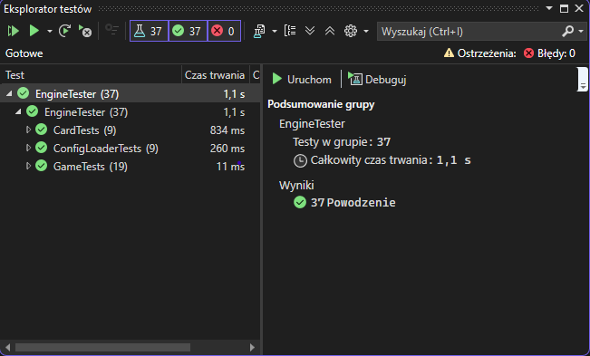
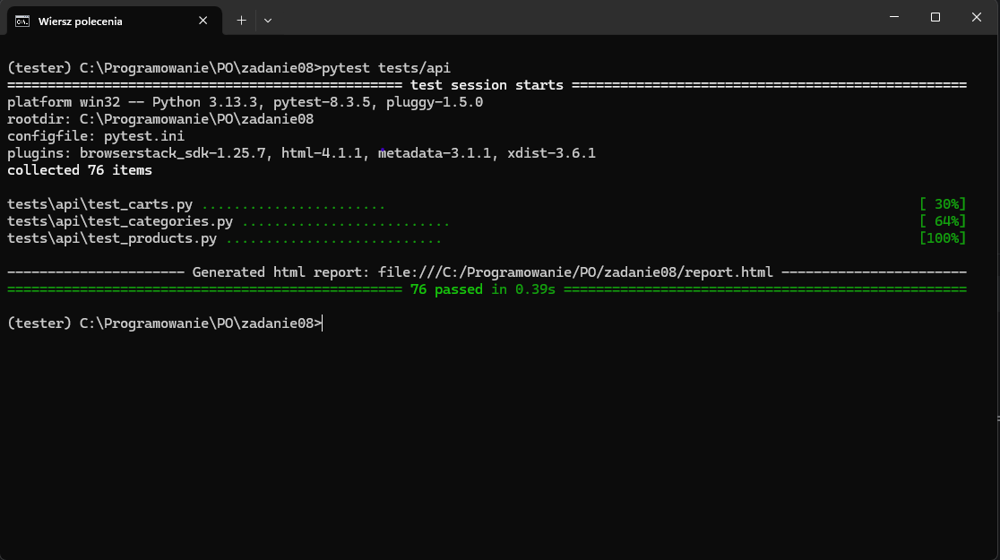
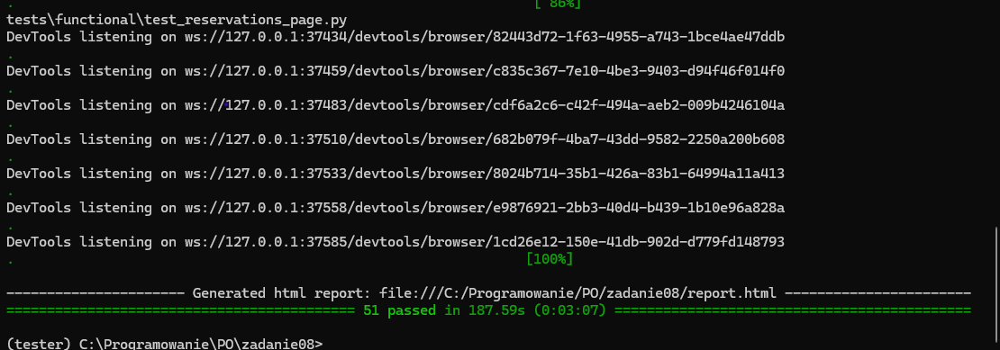
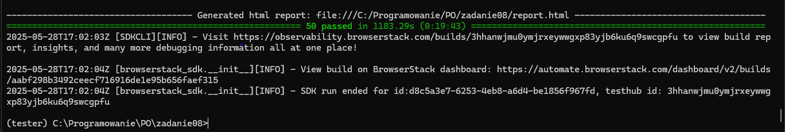

### Testy Jednostkowe
- 114 asercji
- dla projektu gry w C#
- testy w MSTest
- link do gry -> https://github.com/noxikoxi/Cosmopoly
- commit z testami -> https://github.com/noxikoxi/Cosmopoly/commit/1144297f9a9676ea910126c165370b540649f17b
- link do folderu z testami -> https://github.com/noxikoxi/Cosmopoly/tree/main/EngineTester

### Testy API
- dla projektu https://github.com/noxikoxi/ebiznes/tree/main/zadanie04
- raport pytest https://github.com/noxikoxi/PO/tree/main/zadanie08/API_report.html

### Testy Funkcjonalne
- dla projektu https://github.com/noxikoxi/MaszynaNaDzien

- wyniki lokalnie

- raport pytest https://github.com/noxikoxi/PO/tree/main/zadanie08/functional_report.html

### BrowserStack
- Aby uruchomić testy na browserstack należy stworzyć i uzupełnić plik konfiguracyjny browserstack.yml. Uzupełnić w nim username oraz access key.

Link do testów na browserstack:
- https://observability.browserstack.com/projects/MaszynNaDzien/builds/MobileTest/12?public_token=0135423e4f54a6a644a415060737bf7ffcb8cf3c9d740ca90789d0a70f98d82b

Końcowy commit zadania:
- https://github.com/noxikoxi/PO/commit/cca9e046765d084dc799ef18befa2f5818c38072
